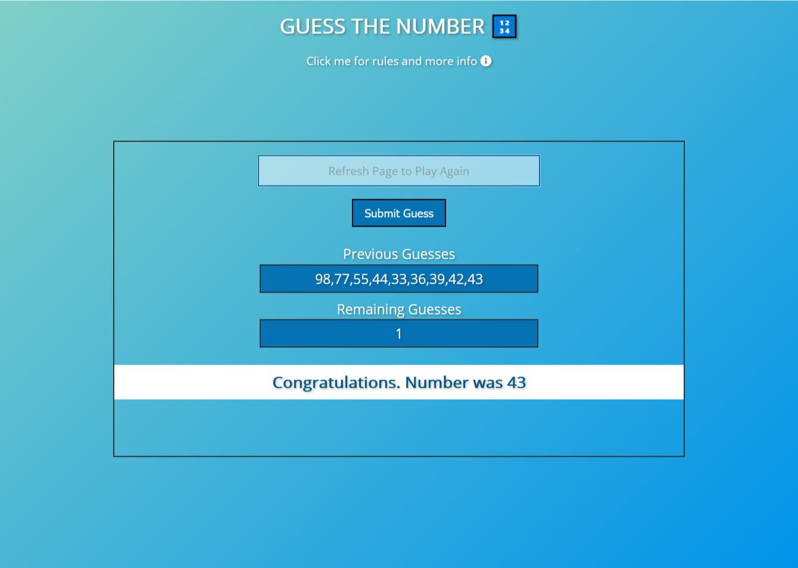

# Guess the number app
 

 

Another classic project for begginers in JavaScript. 
I added few extra details, like sounds for guess inputs, winning or losing the game.
I tried to make the app as user-friendly as possible, by adding autofocus on input fields, 
and making guess submitting possible with 'RETURN' key same as with the button.

